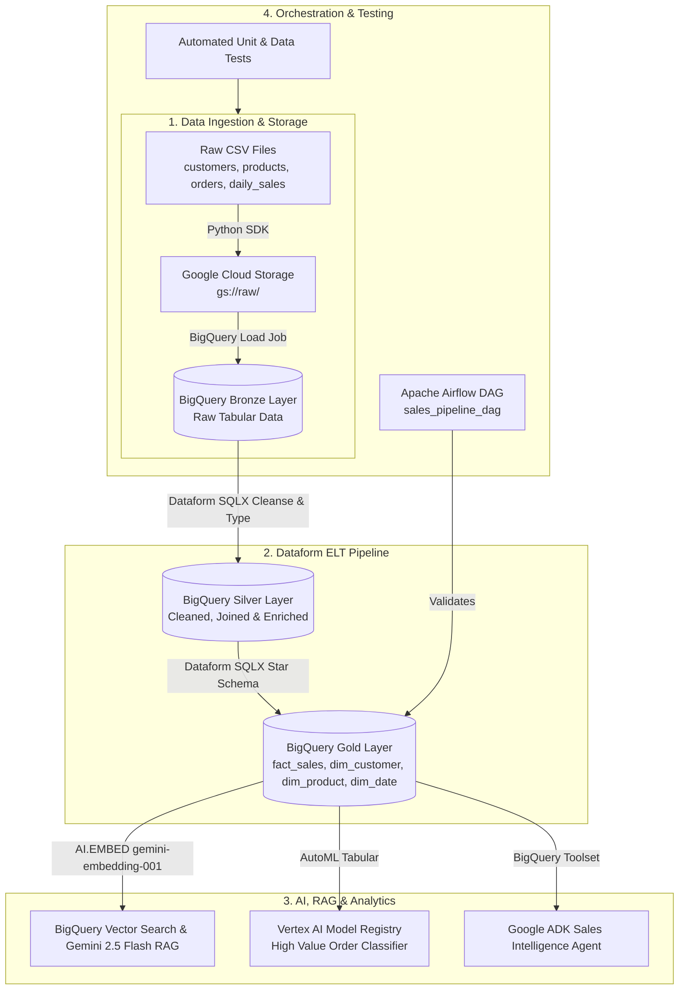

# Retail Sales Intelligence Platform (GCP Medallion Lakehouse & AI Suite)

A production-grade, end-to-end data platform built on **Google Cloud Platform (GCP)** leveraging a **Medallion Architecture (Bronze &rarr; Silver &rarr; Gold)**, **Dataform (SQLX)** for ELT transformations, **Vertex AI / Gemini** for RAG and predictive ML classification, **Google Agent Development Kit (ADK)** for natural language sales intelligence, and **Apache Airflow** for orchestration.

---

## 1. Architecture Overview



---

## 2. Directory Structure

```text
├── agent/
│   └── sales_agent/           # Google ADK Sales Intelligence Agent with BigQuery Toolset
│       ├── agent.py
│       └── __init__.py
├── airflow/
│   └── dags/                  # Apache Airflow Pipeline DAGs
│       └── sales_pipeline_dag.py
├── data/                      # Sample Raw Data Files
│   ├── customers.csv
│   ├── products.csv
│   ├── orders.csv
│   └── daily_sales_summary.csv
├── dataform/                  # Dataform Transformation Repository
│   ├── definitions/
│   │   ├── sources/           # Bronze table declarations
│   │   ├── silver/            # Cleaned and enriched models
│   │   └── gold/              # Star schema dimensions & facts
│   ├── includes/
│   └── workflow_settings.yaml
├── infrastructure/            # Infrastructure as Code (Terraform)
│   └── main.tf
├── rag/                       # BigQuery Vector Search & Gemini RAG
│   ├── create_embeddings.py
│   └── search_rag.py
├── src/                       # Ingestion & GCP Setup Scripts
│   ├── setup_gcp.py
│   ├── upload_to_gcs.py
│   ├── generate_summary.py
│   └── load_to_bigquery.py
├── tests/                     # Validation & Data Integrity Tests
│   └── test_pipeline.py
├── vertex_ml/                 # Vertex AI AutoML Tabular Classification
│   ├── train.py
│   ├── create_dataset.py
│   └── train_model.py
├── .env.example               # Environment Configuration Template
├── .gitignore
├── requirements.txt
└── README.md
```

---

## 3. GCP Services & Integrations

- **Google Cloud Storage (GCS)**: Scalable object storage for raw CSV files (`/raw` directory prefix).
- **BigQuery (Bronze, Silver, Gold Datasets)**: Central data warehouse hosting medallion layers.
- **Dataform**: Version-controlled SQLX modeling layer automating dependency resolution, testing, and DDL/DML compilation.
- **Vertex AI Embeddings & BigQuery Vector Search**: Uses `gemini-embedding-001` and BigQuery `VECTOR_SEARCH` with Cosine distance.
- **Vertex AI AutoML Tabular**: Binary classifier predicting `high_value_order` (&ge; $10,000) using AU-ROC optimization.
- **Google GenAI / ADK Agent**: LLM agent equipped with native BigQuery tools for real-time natural language query execution.
- **Apache Airflow**: Orchestration DAG validating data presence and metrics across gold layers.

---

## 4. Setup & Execution Guide

### Prerequisites
- Python 3.10+
- Google Cloud SDK (`gcloud`) installed and authenticated:
  ```bash
  gcloud auth login
  gcloud auth application-default login
  gcloud config set project mock-trail-project-1
  ```
- Dataform CLI (`@dataform/cli`):
  ```bash
  npm i -g @dataform/cli
  ```

### Installation
1. Clone the repository:
   ```bash
   git clone https://github.com/surya241022/mock_hackathon_1.git
   cd mock_hackathon_1
   ```
2. Create and activate virtual environment:
   ```bash
   python -m venv .venv
   # Windows:
   .\.venv\Scripts\activate
   # Linux/macOS:
   source .venv/bin/activate
   ```
3. Install dependencies:
   ```bash
   pip install -r requirements.txt
   ```
4. Configure environment variables:
   ```bash
   cp .env.example .env
   # Update variables in .env as appropriate
   ```

---

### Step-by-Step Pipeline Execution

#### Step 1: Infrastructure & Storage Ingestion
```bash
# Setup bucket and GCP services
python src/setup_gcp.py

# Upload raw CSV datasets to Cloud Storage
python src/upload_to_gcs.py

# Ingest GCS data into BigQuery Bronze dataset
python src/load_to_bigquery.py
```

#### Step 2: Dataform Transformations (Silver & Gold)
```bash
cd dataform

# Compile definitions and verify dependency graph
dataform compile

# Execute pipeline to build Silver & Gold layers
dataform run

cd ..
```

#### Step 3: Vertex AI Machine Learning Pipeline
```bash
# 1. Create ML training table in BigQuery Gold
python vertex_ml/train.py

# 2. Register Tabular Dataset in Vertex AI
python vertex_ml/create_dataset.py

# 3. Train AutoML Classification Model
python vertex_ml/train_model.py
```

#### Step 4: BigQuery Vector Search & Gemini RAG
```bash
# 1. Create text documents and generate embeddings using BigQuery AI.EMBED
python rag/create_embeddings.py

# 2. Query knowledge base using Vector Search + Gemini
python rag/search_rag.py
```

#### Step 5: Sales Intelligence Agent
```bash
python -m agent.sales_agent.agent
```

---

## 5. Testing & Validation

Run the automated data integrity and schema validation test suite:
```bash
python -m unittest discover -s tests -p "test_*.py"
```

Validation scenarios verified:
- Schema conformance across all entities (customers, products, orders, daily_sales).
- Primary and Foreign key constraints.
- Positive numerical validation on prices and quantities.

---

## 6. Sample Inputs & Outputs

### Sample Input (`data/orders.csv`)
```csv
order_id,order_date,customer_id,product_id,quantity,status,payment_method
1001,2026-01-15,1,101,2,Completed,Credit Card
1002,2026-01-16,2,103,1,Completed,UPI
```

### Sample Output (BigQuery `gold.fact_sales`)
```json
{
  "order_id": 1001,
  "date_key": 20260115,
  "customer_key": -3849102837482910,
  "product_key": 4829102837482919,
  "quantity": 2,
  "unit_price": 45000.0,
  "total_sales": 90000.0,
  "status": "Completed",
  "payment_method": "Credit Card"
}
```

---

## 7. Key Decisions, Assumptions & Limitations

### Key Decisions
1. **Medallion Pattern with Dataform**: Enforces separation of concerns (raw ingestion vs. cleaned relational models vs. star schema dimension modeling).
2. **BigQuery-Native Vector Search**: Leveraged BigQuery `AI.EMBED` and `VECTOR_SEARCH` to eliminate the latency and cost of syncing data to third-party vector databases.
3. **Surrogate Key Generation**: Used deterministic `FARM_FINGERPRINT` for dimensional surrogate keys.

### Assumptions
- Source CSV files in GCS follow standard UTF-8 CSV formatting with headers.
- BigQuery location and Vertex AI region are aligned in `asia-south1` to minimize egress cost and latency.

### Limitations
- Batch-oriented architecture: Stream processing (e.g. Pub/Sub + Dataflow) is not enabled in this batch phase.
- Vertex AI AutoML training is budgeted for basic evaluation and can be scaled for production hyperparameter sweeps.

---

## 8. Security Considerations

- **Secrets Management**: `.env` and `.df-credentials.json` are excluded via `.gitignore`.
- **IAM Best Practices**: Uses Google Cloud Application Default Credentials (ADC) without embedding static service account keys in code.
- **Least Privilege Access**: Dedicated GCP service roles for BigQuery Data Editor, Storage Object Viewer, and Vertex AI User.

---

## 9. AI-Tool Usage Declaration

- **Google Gemini 2.5 Flash / embedding-001**: Used for RAG retrieval augmentation, embeddings generation, and natural language reasoning inside the ADK agent.
- **Antigravity AI IDE / Pair Programmer**: Utilized for scaffolding SQLX models, structuring pipeline architecture, and formulating documentation.
